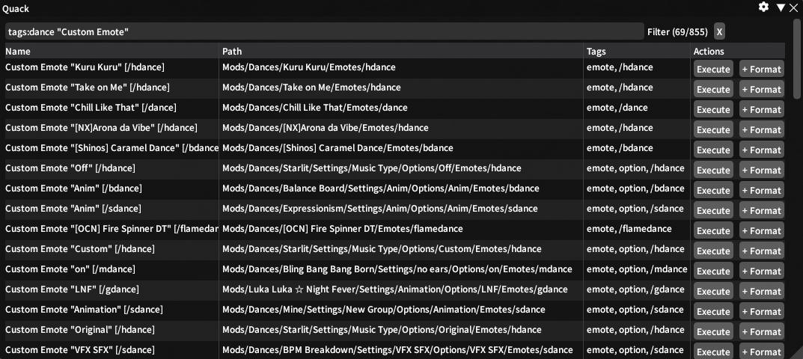
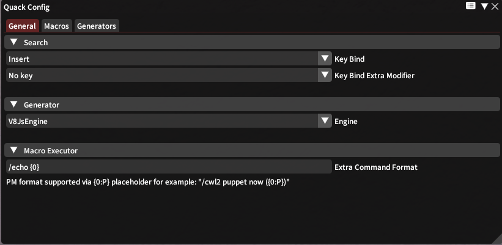
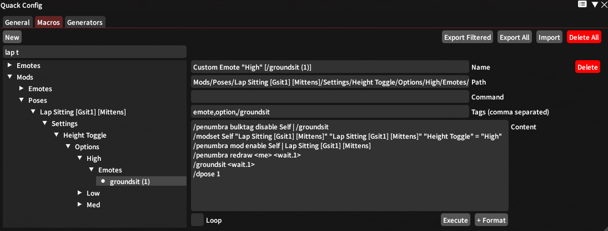
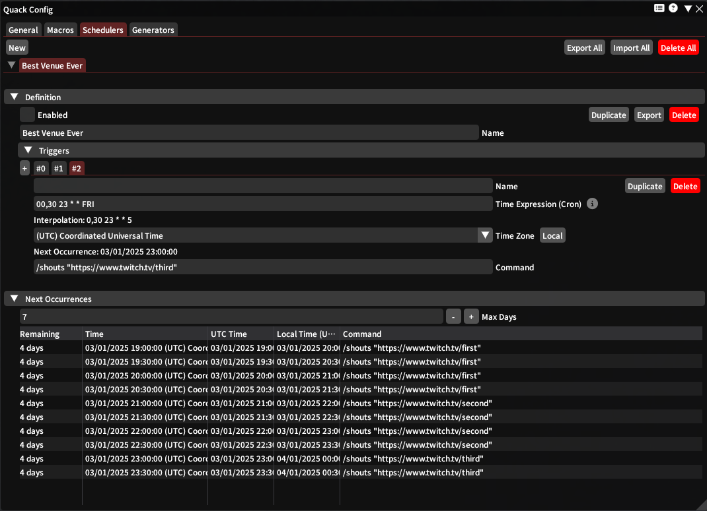

# Quack 

Generate and run macro actions quickly using a spotlight inspired interface.

Installable using my custom repository (https://github.com/anya-hichu/DalamudPluginRepo) or from compiled archives.

## Screenshots

### Main (search)

### Config
#### General

#### Macros

#### Generators

## Commands

- `/quack main`
- `/quack config`
- `/quack exec [Macro Name or Path]( | [Formatting (false/true/format)])?`
