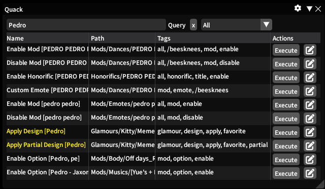
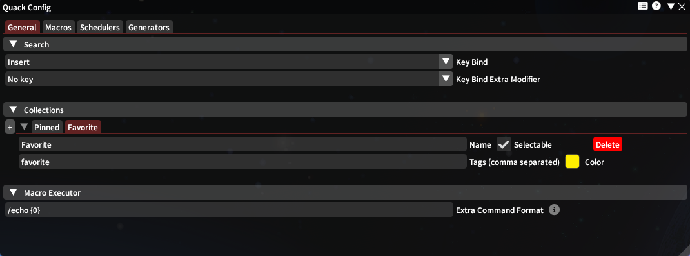
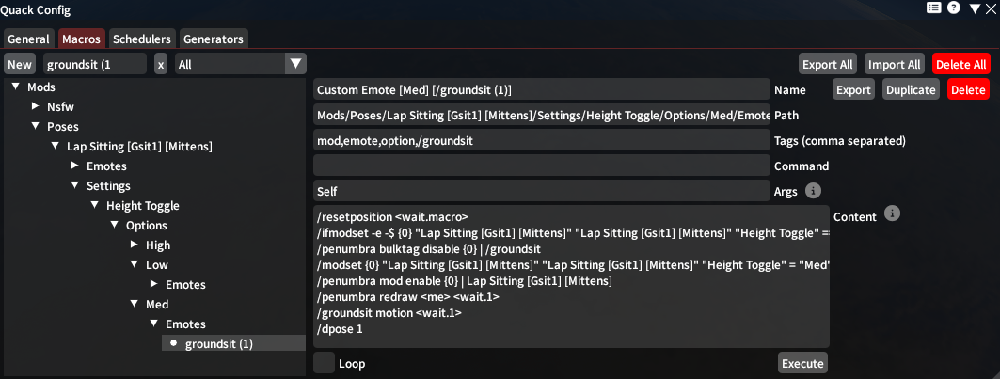
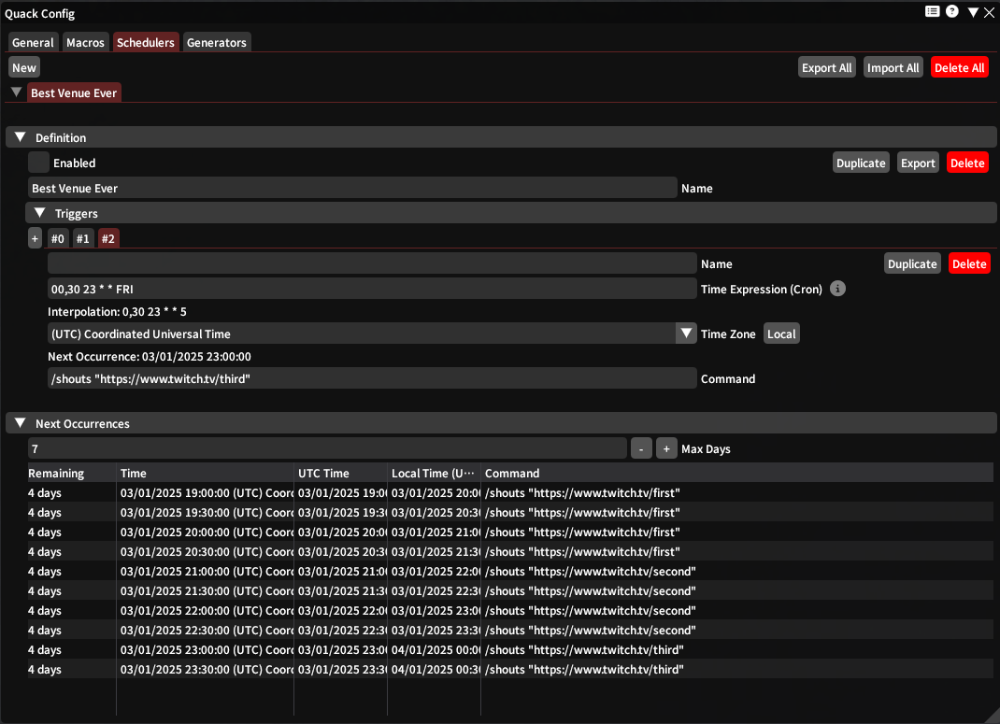
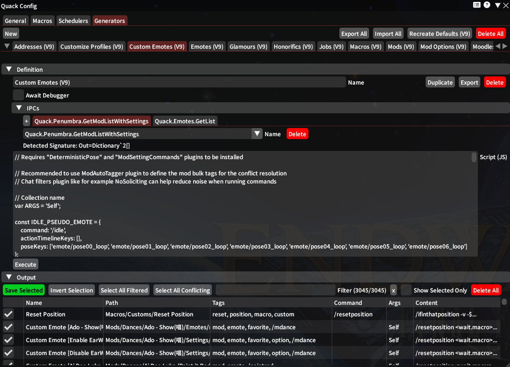

# Quack 

Generate and run macro actions quickly using a spotlight inspired interface.

Installable using my custom repository (instructions here: https://github.com/anya-hichu/DalamudPluginRepo) or from compiled archives.

## Tutorial

[Available here](TUTORIAL.md)

Offline PDF versions are published on the release pages.

## Screenshots

### Main (search)

### Config
#### General

#### Macros

#### Schedulers

#### Generators

## Commands

- `/quack main`
- `/quack config`
- `/quack exec [Macro Name or Path]( [Formatting (false/true/format)])?( [Argument Value])*` (double quoting support)
- `[Macro Command]( [Argument Value])*` (double quoting support)
- `/quack cancel` - Cancel all executing macros (/macrocancel is scoped)
